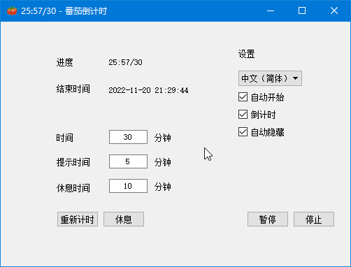
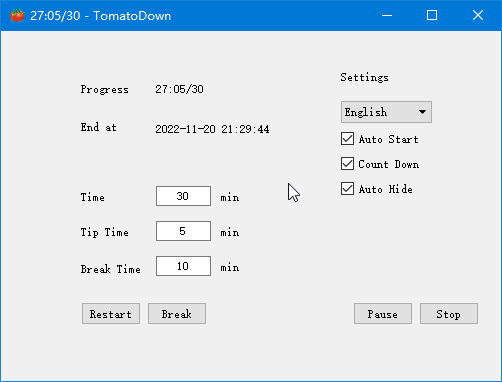
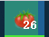

# 番茄倒计时 TomatoDown
实现番茄工作法的计时工具。没有强制约束，仅在任务栏图标上显示倒计时进度、间隔进度，间隔超时后显示超时分钟数。

## 界面

## 任务栏进度

倒计时：

休息：

超时：

## 开发环境

本地环境是MinGW，IDE用的Qt creator + CLion，Qt creator 仅用于编译，Clion中写代码。

注意CMakeLists.txt，仅仅为了实现语法高亮而引入了Qt的库，没有测试是否能够编译。但QtMultiMedia引入失败，有部分会有语法错误提示。

